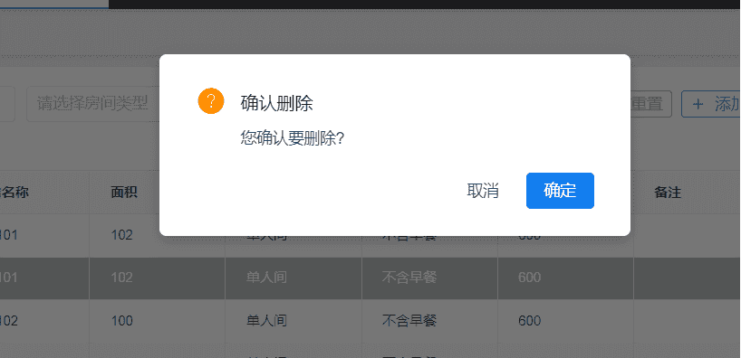
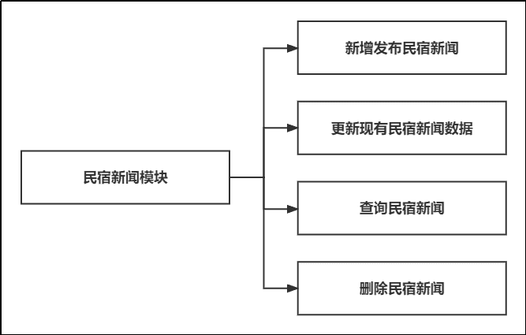
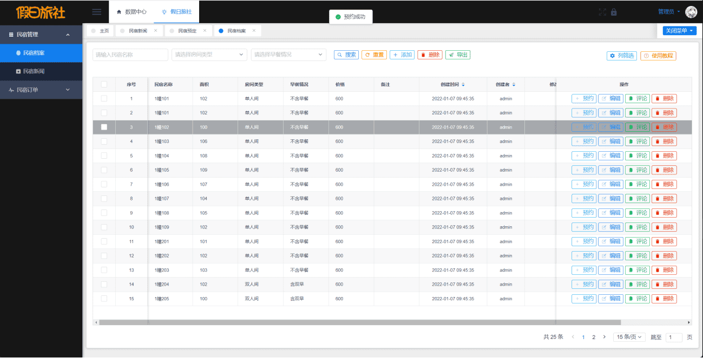
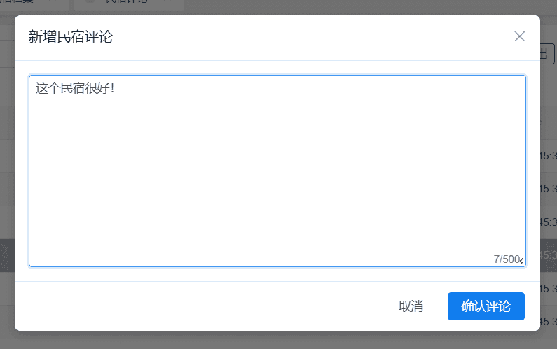

# 基于 Vue 和 SpringBoot 的 假日旅社管理系统


## 软件简介

本软件是《基于 Vue 和 SpringBoot 的假日旅社管理系统》，支持**民宿档案、民宿新闻、民宿预定、民宿评论**这四大核心业务，适用于乡村民宿企业的民宿预定业务。系统给每个民宿档案提供一个唯一标识，对民宿预定、评论等各个环节进行快速批量的数据采集，确保游客及时掌握景区民宿的真实数据，方便游客进行民宿预定。另外系统还包括员工管理、组织机构管理、文件管理、权限管理功能，给旅社企业提供更个性化的民宿管理模式。

假日旅社管理系统采用了**基于角色的访问控制**，角色和菜单关联，一个角色可以配置多个菜单权限；然后再将用户和角色关联，一位用户可以赋予多个角色。这样用户就可以根据角色拿到该有的菜单权限，更方便旅社企业的管理人员进行权限管控。

## 部署说明

如您的 Vue 脚手架为老版本（3.0.4），请将前端 package.json 文件的 devDependencies 依赖版本修改为：

```javascript
"devDependencies": {
    "@vue/cli-plugin-babel": "4.5.17",
    "@vue/cli-plugin-router": "4.5.17",
    "@vue/cli-plugin-vuex": "4.5.17",
    "@vue/cli-service": "4.5.17",
    "compression-webpack-plugin": "3.0.0",
    "less": "3.10.3",
    "less-loader": "5.0.0",
    "vue-template-compiler": "2.6.14"
}
```

当前项目使用了最新的脚手架，对应依赖版本为如下所示，其中 vue-template-compiler 版本需和 vue 版本一致。

```javascript
"devDependencies": {
    "@vue/cli-plugin-babel": "5.0.8",
    "@vue/cli-plugin-router": "5.0.8",
    "@vue/cli-plugin-vuex": "5.0.8",
    "@vue/cli-service": "5.0.8",
    "compression-webpack-plugin": "9.2.0",
    "less": "4.1.3",
    "less-loader": "11.1.0",
    "vue-template-compiler": "2.7.10"
}
```

脚手架升级步骤：

```java
// 卸载现有脚手架
npm uninstall -g @vue/cli
// 安装最新脚手架(nodejs 版本也需要 18 哦)
npm install -g @vue/cli
// 可选淘宝镜像
npm install -g cnpm --registry=http://registry.npm.taobao.org
npm config set registry https://registry.npm.taobao.org
```

## 软件技术选型

### 前端

Vue：Vue 是构建前端界面的核心框架，本系统采用 2.6.14 版本。

View UI：基于 Vue.js2.0 的组件库，本系统采用 4.7.0 版本。

### 后端

Spring Boot：构建系统核心逻辑的后端框架，本系统采用 2.7.0 版本。

MyBatis / MyBatis Plus：后端连接数据库的框架，本系统采用 3.5.2 版本。

### 数据库

MySQL：本项目的主数据库，本系统采用 8.0.29 版本。

Redis：本系统采用基于 Windows 版本的 Redis，用于图形验证码和用户菜单权限的临时存储，采用了 5.0.14 版本。

### 开发环境

VsCode：项目前端的开发工具，使用版本为 1.68.0。

IntelliJ IDEA ：项目后端的开发工具，使用版本为 2021.3.2。

Jdk：Java 的开发环境，使用版本为 17.0.3.1。

Maven：后端项目的打包工具，使用版本为 3.6.2。

NodeJs：前端项目的开发环境，使用版本为 16.13.0。

## 软件架构分析

基于 Vue 和 SpringBoot 的假日旅社管理系统包括了系统基础模块、民宿档案模块、民宿新闻模块、民宿预定模块、民宿评论模块这五大功能模块，其架构如下图所示。


接下来，分别对五大模块进行详细介绍。

## 系统基础模块

系统基础模块，是用于支撑假日旅社管理系统的正常运行，这个模块包括了登陆注册模块、员工部门管理、菜单权限管理等。

假日旅社管理系统支持用户使用账号、密码和图形验证码登陆，操作界面如下图所示。


用户输入正确的账号（如 admin）、密码（如 123456）和图形验证码后，点击登陆按钮，即可进入到系统首页，系统登陆的流程如下图所示。


假日旅社管理系统支持用户使用手机号、姓名、密码和图形验证码注册，操作界面如下图所示。

  

用户输入正确格式的手机号（如 17857050001）、姓名（张三）、密码（如 123456）和图形验证码后，点击注册按钮，即可完成注册。注册成功后会自动跳转到登陆页，需要用户用注册的手机号和密码进行登陆，系统注册的流程图如下所示。


用户成功进入系统后，可进入到基于 Vue 和 SpringBoot 的假日旅社管理系统的首页，首页展示了当前登陆的地址、现在的时间和用户配置的常用模块，如下图所示。


接着用户点击左侧的用户管理，即可进入用户管理模块，用户管理模块的首页如下图所示。


用户可以在这个模块对系统登陆用户的档案进行维护，包括添加新用户、删除用户、编辑用户、根据姓名/部门查询用户。

用户可以进入部门管理模块，管理旅社的部门数据，如下图所示。


同理用户可以进入到菜单管理模块，对系统的菜单进行管理，菜单管理模块的操作界面如下图所示。


用户可以进入到角色管理模块，对单个角色赋予指定的菜单权限，从而让用户拥有指定角色的菜单权限，角色权限分配的界面如下图所示。


## 民宿档案模块

第二个模块是民宿档案模块，民宿档案就是用来管理民宿的数据，包含的功能如下所示。


民宿档案包括民宿的名称、面积、房号、房间类型、早餐情况、价格、备注等，以下是民宿档案模块的主界面。


民宿实体类的字段明细如下：

| 字段名称    | 数据类型   | 长度 | 字段含义     | 备注       |
| ----------- | ---------- | ---- | ------------ | ---------- |
| Id          | Varchar    | 255  | 唯一标识     | 非空，主键 |
| Title       | Varchar    | 255  | 民宿名称     | 非空       |
| areaSize    | BigDecimal | 255  | 面积         | 非空       |
| type        | Varchar    | 255  | 民宿类型     | 非空       |
| breakfast   | Varchar    | 15   | 早餐情况     | 非空       |
| price       | BigDecimal | 15   | 价格         | 非空       |
| remark      | Varchar    | 255  | 备注         |            |
| create_time | DateTime   | 15   | 创建时间     | 自动生成   |
| create_by   | Varchar    | 255  | 创建人       | 自动生成   |
| update_time | DateTime   | 15   | 最后更新时间 | 自动生成   |
| update_by   | Varchar    | 255  | 最后更新人   | 自动生成   |

用户可以点击顶部的“新增”按钮，进入民宿档案添加界面，添加民宿档案数据，如下图所示。


其中房间类型为下拉框单项选择，如下图所示。


还有早餐情况也是下拉单选，如下图所示。


用户可以对现有的民宿档案数据进行编辑更新，只需点击每一行民宿档案数据的“编辑”按钮，即可进入民宿档案数据的编辑界面，如下图所示。


用户也可以对不需要的民宿数据进行删除操作，用户点击删除时，系统会弹出二次确认弹框，如下图所示。



## 民宿新闻模块

第三个模块是民宿新闻模块，民宿新闻就是用来管理民宿的新闻资讯，包含的功能如下所示。



民宿新闻包括民宿的名称、面积、房号、房间类型、早餐情况、价格、备注等，以下是民宿新闻模块的主界面，其中的图片仅供测试样例使用。


民宿新闻实体类的字段明细如下：

| 字段名称    | 数据类型 | 长度 | 字段含义     | 备注       |
| ----------- | -------- | ---- | ------------ | ---------- |
| Id          | Varchar  | 255  | 唯一标识     | 非空，主键 |
| newTitle    | Varchar  | 255  | 新闻标题     | 非空       |
| newDescribe | Varchar  | 255  | 新闻描述     | 非空       |
| periodTime  | Varchar  | 255  | 新闻时效     | 非空       |
| isPublic    | Varchar  | 255  | 是否公开     | 非空       |
| photo       | Varchar  | 255  | 图片         | 非空       |
| isTop       | Varchar  | 255  | 是否置顶     | 非空       |
| nSort       | Varchar  | 255  | 排序值       | 非空       |
| remark      | Varchar  | 255  | 备注         |            |
| create_time | DateTime | 15   | 创建时间     | 自动生成   |
| create_by   | Varchar  | 255  | 创建人       | 自动生成   |
| update_time | DateTime | 15   | 最后更新时间 | 自动生成   |
| update_by   | Varchar  | 255  | 最后更新人   | 自动生成   |

用户可以点击顶部的“新增”按钮，进入民宿新闻添加界面，添加民宿新闻数据，如下图所示。


新闻描述字段采用了 ueditor 富文本编辑器，这是由百度 web 前端研发部开发的所见即所得的开源富文本编辑器，具有轻量、可定制、用户体验优秀等特点，基于 MIT 开源协议，所有源代码可自由修改和使用。

用户可以对现有的民宿新闻数据进行编辑更新，只需点击每一行民宿新闻数据的“编辑”按钮，即可进入民宿新闻数据的编辑界面，如下图所示。


用户也可以对不需要的民宿新闻数据进行删除操作，用户点击删除时，系统会弹出二次确认弹框，如下图所示。


## 民宿预定模块

第四个模块是民宿预定模块，旅客可以在民宿预定模块中预定民宿，达到旅客的住宿目的，民宿预定模块包含的功能如下所示。


民宿预定包括了预定民宿 ID、预定民宿名称、预定日期、下单时间、下单人 ID、下单人姓名、价格、是否付款、下单备注等字段，旅客首先进入民宿档案模块，可以看到每一行民宿数据都有一个预约按钮，如下图所示。


如用户点击 1 幢 102 民宿的预约按钮后，会弹出预约确认框，需要输入预约的日期，日期表单默认选择今日，如下图所示。


旅客需要点击“确认预约”按钮，完成预约操作，系统给与“预约成功”提示，如下图所示。



预约成功后，旅客可以从民宿预定模块中进行查询，如下图所示。


最后旅客进行付款操作，点击每一行右侧的付款按钮，如下图所示。


支付完成后，系统将预定单的支付状态改为付款，预定流程结束，如下图所示。


民宿预订单实体类的字段明细如下：

| 字段名称      | 数据类型   | 长度 | 字段含义     | 备注       |
| ------------- | ---------- | ---- | ------------ | ---------- |
| Id            | Varchar    | 255  | 唯一标识     | 非空，主键 |
| dormitoryId   | Varchar    | 255  | 民宿 ID       | 非空       |
| dormitoryName | Varchar    | 255  | 民宿名称     | 非空       |
| orderDate     | Varchar    | 255  | 预定日期     | 非空       |
| orderTime     | Varchar    | 255  | 下单时间     | 非空       |
| userName      | Varchar    | 255  | 下单人       | 非空       |
| userId        | Varchar    | 255  | 下单人 ID     | 非空       |
| price         | BigDecimal | 15   | 价格         | 非空       |
| payFlag       | Varchar    | 255  | 是否付款     | 非空       |
| remark        | Varchar    | 255  | 下单备注     |            |
| create_time   | DateTime   | 15   | 创建时间     | 自动生成   |
| create_by     | Varchar    | 255  | 创建人       | 自动生成   |
| update_time   | DateTime   | 15   | 最后更新时间 | 自动生成   |
| update_by     | Varchar    | 255  | 最后更新人   | 自动生成   |

## 民宿评论模块

第五个模块是民宿预定模块，旅客可以在民宿预定结束后评论民宿，以帮助更多的人了解民宿，民宿评论模块包含的功能如下所示。


民宿评论包括了民宿名称、民宿 ID、评论时间、评论内容、评论人 ID、评论人姓名等字段，旅客首先进入民宿档案模块，可以看到每一行民宿数据都有一个评论按钮，如下图所示。


旅客点击评论后，系统给与弹框反馈，如下图所示。


用户输入评论内容后，点击确认评论按钮，即可完成评论操作，如下图所示。



旅客评论后，即可在民宿评论模块中查看此评论数据，如下图所示。


也可以在民宿模块中，双击民宿数据查看评论信息，如下图所示。


## 项目总结

本软件是基于 Vue 和 SpringBoot 的假日旅社管理系统，包含了**民宿档案、民宿新闻、民宿预定、民宿评论**这四个功能模块。

开发本系统的目的，就是为了帮助旅游景点的民宿企业提高民宿管理效率，降低人力成本，让旅游景点的民宿企业获得更多的经济效益。

## 开发模板介绍

《基于 Vue 和 SpringBoot 的假日旅社管理系统》是基于《基于 Vue 和 SpringBoot 的通用管理系统》开发的，模板包含了**登陆注册、用户管理、部门管理、文件管理、权限管理、日志管理、个人中心、数据字典和代码生成**这九个功能模块，另外还有两张样例数据表和五张样例数据图，是一个很好的前后端分离开发模板，开发者可以在这个模板上进行二次开发，只需要实现需求方的业务逻辑，即可快速成型甲方的业务需求。

模板采用了**基于角色的访问控制**，角色和菜单关联，一个角色可以配置多个菜单权限；然后再将用户和角色关联，一位用户可以赋予多个角色。这样用户就可以根据角色拿到该有的菜单权限，更方便管理者进行权限管控。

模板还**封装了文件管理功能**，在其他模块如若要实现图片/文件上传预览时，前端只需导入现成的 Vue 组件即可实现（使用 viewerjs 依赖实现），后端只需定义 String 类型的实体类变量即可，无需再去研究文件上传预览的相关功能，简化了开发者的工作量。

模板还自带**基于 beetl 代码生成器**功能，开发者只需要输入类名（如 Student）和类备注（如学生），运行 main 函数即可自动生成后端的所有 MVC 结构代码，无需开发增删改查的 API 接口。对于前端，开发者只需输入后端实体类的完整路径，利用 Java 的反射原理，拿到后端实体类的字段，即可自动生成前端所有代码，生成的模块代码包含基础的增删改查功能，简化开发者的工作量。

```java
开发模板仓库：https://gitee.com/yyzwz/template
```

## 免责声明

- 本项目开源，仅供个人学习使用，遵循 GPL-3.0 开源协议，**转发 / 商用授权请联系作者，否则后果自负**。
- 作者拥有本软件构建后的应用系统全部内容所有权及独立的知识产权（**软件著作权登记号：2022SR1338868**））。
- 如有问题，欢迎在仓库 Issue 留言，看到后会第一时间回复。相关意见会酌情考虑，但没有一定被采纳的承诺或保证。

下载本系统代码的用户，**必须同意以下内容，否则请勿下载**！

1. 出于自愿而使用/开发本软件，了解使用本软件的风险，且同意自己承担使用本软件的风险。
2. 利用本软件构建的网站的任何信息内容以及导致的任何版权纠纷和法律争议及后果和作者无关，作者对此不承担任何责任。
3. 在任何情况下，对于因使用或无法使用本软件而导致的任何难以合理预估的损失（包括但不仅限于商业利润损失、业务中断与业务信息丢失），作者概不承担任何责任。
4. 必须了解使用本软件的风险，作者不承诺提供一对一的技术支持、使用担保，也不承担任何因本软件而产生的难以预料的问题的相关责任。
